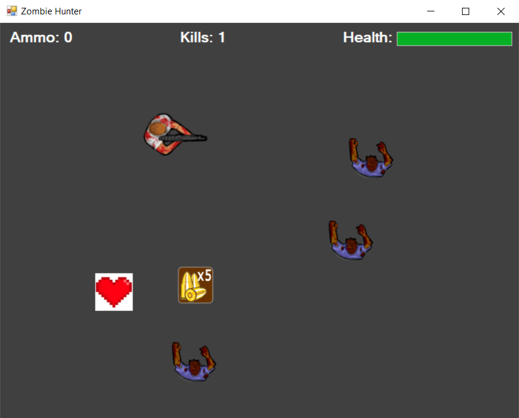

# Zombie Hunter

Zombie Hunter е 2D "Survival Game", која се заснова на идејата на преживување. Играта е составена од 3 зомбиња и 1 играч, чија цел е да ги елиминира и да остане жив што е можно подолго.

<p float="left">
  
</p> 


**Упатство за игра:**

Играчот може да се движи низ полето со помош на стрелките на тастатура, додека зомбињата цело време се упатуваат кон него со цел да го изедат. Играчот на стартот на играта има 10 куршуми на располагање и ги испукува со притискање на **space** копчето. Кога тој ќе ги истроши истите, на рандом место на полето се појаува коцка муниција, која кога играчот ќе помине врз неа, тој добива 5 дополнителни куршуми. Коцката муниција се појавува исклучително откако играчот ќе ја искористи муницијата. Со секој контант меѓу зомбито и играчот, HP на играчот се намалува. Исто така, се појавуваат и HP кутии кои играчот може да ги 
собира со тоа што ќе помине врз нив. На полето може да има најмногу 3 вакви HP кутии кои играчот може да ги собере.

**Функционалноста** на играта е имплементирана во класите <a href="Zombie%20Hunter/Form1.cs" class="special">Form1</a> и <a href="Zombie%20Hunter/Bullet.cs" class="special">Bullet</a>. 

Bullet.cs е наменета исклучиво за имплементација на физиката на куршумот кој играчот го испукува. Истата е составена од две методи кои служат за исцртување на куршумот кога таа метода ќе се повика и метода која ја дава насоката на куршумот. Исто така класата има атрибути како PictureBox, Timer, speed и direction.

Form1.cs е класата во која е сместена целата логика на играта. Составена е од методи за различна намена, од методи за визуелизација на играчот, зомбињата, кушумите, ammo и hp кутиите, до методи кои пресметуваат изминато време, позиција на играчот, позиција на зомбињата, рестартирање на играта. Овие методи се имплементирани во **MainTimerEvent()**.

При стартување на играта, иницијалните вредности на играта се поставени на овие вредности:
```cs
string facing = "up";
int playerHealth = 100;
int speed = 10;
int ammo = 10;
int zombieSpeed = 2;
int hpdropped = 0; 
```

Кога играчот ќе ги потроши првичните 10 куршуми, играта поставува ammo кутија на произволна позиција на полето, а од таа ammo кутија играчот добива +5 куршуми кои може да ги користи. Ова е имплементирано во следниот код.

```cs
if (e.KeyCode == Keys.Space && ammo > 0 && gameOver == false)
{
      ammo--;
      ShootBullet(facing);
      if (ammo < 1)
      {
      DropAmmo();
      }
}
```

Исто така, кога hp-то ќе му биде намалено од зомбињата, играт апоставува hp кутија на произволна позиција на полето, од која добива тој добива +10 или од 0-9 hp, зависи колку hp му недостига.

```cs
if (x is PictureBox && (string)x.Tag == "hp")
{
        if (player.Bounds.IntersectsWith(x.Bounds))
        {
                        this.Controls.Remove(x);
                        ((PictureBox)x).Dispose();
                       
                        if (playerHealth == 100)
                        {
                            playerHealth = playerHealth + 0;
                        }

                        else if (playerHealth > 90)
                        {
                            int remaining = 100 - playerHealth;
                            playerHealth += remaining;
                        }

                        else
                        {
                            playerHealth += 10;
                        }

                        hpdropped -= 1;
        }
}
```

Проверката на бројот на hp кутии кои се поставени на полето, е имплементирана во методите **InitTimer()** и **timer1_Tick()**. На старт на играта е иницијализиран тајмер кој на секои 10 секунди ја повикува методата **DropHealthPoints()**, но под услов играчот да има помала hp вредност од 80 и бројот на поставени кутии на полето да е помал од 3.

```cs
public void InitTimer()
{
            timer = new Timer();
            timer.Tick += new EventHandler(timer1_Tick);
            timer.Interval = 10000; // in miliseconds
            timer.Start();
}
        
private void timer1_Tick(object sender, EventArgs e)
{
            if (playerHealth <= 80 && hpdropped < 3)
            {
                DropHealthPoints();
                hpdropped += 1;
            }
}
```

Откако играчот ќе го надмине score-от од 25 убиства, брзината на зомбињата се зголемува за 1, т.е станува 3.
```cs
if (score >= 25)
{
      zombieSpeed = 3;
}
```

Windows Forms Project by: Kiril Naskovski 181222
